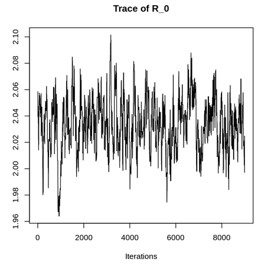

# What are Bayesian statistics?

We’ve used frequentist statistics this entire semester when inferencing a parameter. All samples come from some statistical distribution. A parameter is just a population-specific variable that defines a population-specific distribution. Remember, mu (mean) and sigma (standard deviation) are parameters for a Normal distribution. Within frequentist statistics, when considering mean for instance, we assume there is a true static mean for a population. For most statistical problems, we can’t realistically do a census (i.e., sample the whole population) to figure out this value. Our sample is representative of the population, thus as we collect more and more data, our sample mean should approach the population. Remember sampling distributions, and how increasing n decreases standard error. To estimate population mean, we would estimate the mean of a sampling distribution of means; because of central limit theorem, the mean of this sampling distribution is our estimate of population mean. 

Bayesian statistics, in contrast, views inference through probability terms as a means of quantifying uncertainty about a given parameter. Bayesian inference considers populations and parameters as fluid random variables subject to change. Returning to mean, a Bayesian statistician would still collect data, but they also consider their own prior knowledge about a parameter. As such, Bayesian statisticians model uncertainty based on past information (a priori subjective knowledge about the parameter) as well as current information (their sample). In Bayesian statistics, prior knowledge is called the prior distribution, and our sample is called our likelihood; these can be described with statistical distributions. Rather than constructing a sampling distribution of a statistic to estimate a parameter, the goal of Bayesian statistics to create a probability distribution of the parameter. The probability distribution is called the posterior probability distribution. Our posterior distribution is related to our prior knowledge and our sample. In other words, the posterior distribution is proportional to our prior distribution and our likelihood. Mathematically that looks like: 


Bayesian statistics don’t reject central limit theorem (there actually isn’t drama between the two paradigms), but they may find it impractical for certain statistical questions. For instance, let’s say I want to estimate the average temperature tomorrow. I can use a thermometer to record temperatures from the past week; this is my sample. A frequentist statistician would construct a sampling distribution of these temperatures, and their estimate for tomorrow’s temperature would be the mean of this sampling distribution. Let’s say I hear on the news there’s a cold front coming tomorrow (and we can expect temperatures to drop 20 degrees!). This is prior knowledge about tomorrow’s temperature that the frequentist isn’t using! Bayesian statisticians would create a probability distribution of tomorrow’s average temperature based on the likelihood (the week of temperature data) alongside their prior knowledge (the news says it’s going to be chilly tomorrow!) Both approaches are valid, but I’d expect the Bayesian estimate to be closer to reality! The frequentist relies exclusively on the data, whereas the Bayesian statistician also uses their prior knowledge about a parameter. 


While Bayesian statistics aren’t strictly better than frequentist (again, this is just a different way of thinking about data), there are some instances in which they may be preferred. When sample size is low, or data isn’t Normal, frequentist assumptions often falter. Bootstrapping (as implied by the name, “pulling yourself up by your bootstraps”) is a band-aid to this issue but doesn’t completely circumvent the issue. For instance, if n = 5, there are a possible 120 permutations of samples in a bootstrap. This is better than nothing but it’s hardly a continuous Normal distribution! Bayesian statistics therefore allow us to model uncertainty in such a way that considers our low sample size; if n = 5, our Bayesian model is going to factor in our small sample size when estimating probabilities. 

# An example

The titi monkey homework is based on the article “Estimating Population Density of White-tailed titi monkeys _Callicebus discolor_ via Playback Point Counts” by Dacier A. et al. Here, as opposed to traditional line transect surveys, the authors propose a new method relying on titi monkey calls. Titi monkeys form dyads, and at the start of every morning call out; this cacophony in the canopies can be used to estimate titi monkey numbers. In this study, the playback point count method is argued to be much stronger than the transect estimates. It is known that transect estimates are significantly lower than actual population sizes. To illustrate differences between frequentist and Bayesian inference I’ll simulate titi monkey data and walk through an estimation of mean.


## Loading libraries and simulating data

```{r, libraries}
library(tidyverse)
library(coda)
library(rjags)
```

I’m going to simulate a week’s worth of collections using the playback and transect methods respectively. I’ve used a Poisson distribution parameterized accordingly based on estimates in the paper (playback = 13.8, transect = 4.6). This data is Poisson distributed because it is discrete and a measure of rates (how many titi monkeys in an area; how many calls in a day).  In class, we assumed previous research found there were 15 titi monkeys in the area. Let’s test to see if there are differences between the two methods, and to see if our data supports that there are 15 titi monkeys in the area!

```{r, Poisson_sim}
set.seed(812) # set seed
titi_playback <- rpois(n = 7, lambda = 13.8) # "collect" data via playback point transect
titi_transect <- rpois(n = 7, lambda = 4.6) # "collect" data via transect
mean(titi_playback)
mean(titi_transect)
```

# Frequentist inference

Remember, we’re trying to estimate $\lambda$, the parameter dictating population size for Poisson distributed titi monkeys. $\lambda$ is the average number of titi monkeys in a given area. We've simulated data using two methods (playback and transect) to estimate $\lambda$. I’m testing whether our estimates of $\lambda$ are less than 15; I’m also going to be testing whether our estimates of $\lambda$ are different from one another. Our null hypothesis is that there are 15 titi monkeys in the area. Because I’m simulating this data, we know our samples differ, and that our samples are different from 15. However, because of low sample size, before running the tests, I predict our playback method comes back insignificant. 

## Hypothesis Test

```{r, hyp_test15}
# are these consistent with 15 groups?
t.test(titi_transect, alternative = "less", mu = 15) # is transect more than 15
transect_confint <- t.test(titi_transect, mu = 15)$conf.int[c(1, 2)] # confidence interval
t.test(titi_playback, alternative = "less", mu = 15) # is playback greater than 15
playback_confint <- t.test(titi_playback, mu = 15)$conf.int[c(1, 2)] # confidence interval
t.test(titi_transect, titi_playback) # are they different 
```

First off, because n is so small, we fail central limit theorem assumptions (rule of thumb is n > 30). As a result, despite significance/insignificance, our conclusions are very weak because of sample size. But otherwise, the results come up as expected. The average number of titi monkeys, collected via the transect method is significantly less than 15. The two methods are significantly different from one another. However, the average number of titi monkeys colected via the playback method is not significantly less than 15. How could incorporating our prior knowledge of titi monkeys (that there are 15 in the area) impact our estimates of titi monkeys? </br>

# Bayesian inference with `rjags`

So again, our goal here is to create a posterior probability distribution of $\lambda$ based on our prior knowledge as well as our data. Here, our samples come from a Poisson($\lambda$) distribution. $\lambda$ is distributed by the prior distribution. We choose a prior distribution based on our prior knowledge. Our prior information tells us the past average number of titi monkeys was estimated to be 15. Our null hypothesis from earlier is helping form our prior! So, I'm going to want to use a prior distribution that's centered at 15 and models our relative uncertainty about $\lambda$. </br>

If we’re unsure of the data and how its distributed, we may opt for a uniform prior. We know of two set boundaries that data generally fall between, but we think probabilities within this set boundary are equal (e.g., we’re equally confident titi monkey calls could be parameterized by $\lambda$ = 14, 15, 16, etc.). We have some information about the data, so I probably wouldn't use this prior distribution.

```{r, uniform_distn}
x <- seq(0, 30, by = 0.01)
plot(x, dunif(x, min = 10, max = 20), type = "l", 
     main = "Uniform(10, 20)",
     xlab = "Prior values",
     ylab = "Probabilities")
```

A Normal prior, in contrast, identifies a clear center; we’re more confident $\lambda$ falls closer to 15 than elsewhere. </br>

```{r, Normaldstn}
x <- seq(0, 30, by = 0.01)
plot(x, dnorm(x, mean = 15, sd = 3), type = "l", 
     main = "Normal(15, 3)",
     xlab = "Prior values",
     ylab = "Probabilities")
```


However, I’ve elected to use a Gamma prior, why? </br>

```{r, gamma}
x <- seq(0, 30, by = 0.01)
plot(x, dgamma(x, shape = 15, rate = 1), type = "l", 
     main = "Gamma(15, 1)",
     xlab = "Prior values",
     ylab = "Probabilities")
```

Our data is Poisson generated, meaning it is discrete and nonnegative (could be 0!). While values from a Poisson distribution are discrete, $\lambda$, our parameter, does not need to be discrete. Because $\lambda$ can be continuous, a Poisson prior would not make sense. Normal, uniform, or Gamma priors are all theoretically valid; however, I’ve opted out of a Normal distribution since it can take on negative values (my prior knowledge therefore tells me $\lambda$ is not distributed Normally). I also have an idea of center (past work gave an estimate of 15), so I have more information than a uniform prior suggests. A Gamma prior is nonnegative and continuous; it is parameterized by a shape and scale parameter. Gamma(15, 1) is centered at 15 and gives a sizeable amount of spread around the center as well. Again, other priors will work for this analysis, but Gamma(15, 1) best models my certainty of the parameter. This stack exchange post goes through which priors should work based on how much information you have! (https://stats.stackexchange.com/questions/78606/how-to-choose-prior-in-bayesian-parameter-estimation) If you're unsure of how to parameterize your priors, I recommend plotting some out and adjusting from there. You're showing your own uncertainty about a parameter when you design a prior, so long as your prior is reflective of that, you're good! </br>

We’re going to use a Markov Chain Monte Carlo (MCMC), Metrooplis-Hastings (MH) random walk algorithm to generate our posterior samples using `rjags`. As an aside, another Bayesian package worth checking out is `brms`! Our algorithm is going to be relying on our defined likelihood and prior distributions to generate samples. Our final posterior distribution is going to consist of 10,000 lambda values. To get there we’re going to generate 20,000 posterior samples; from that, we’re going to throw out the first 10,000 samples as adaptation and burn in. Our algorithm is iterative, generating values within the limits of the prior and posterior, but influenced by past generated values. I recommend generating twice as many samples as you’d like to use (what I’ve done is fairly standard) and only keeping the latter half for the posterior distribution. This allows the algorithm to get situated! </br>

## Install JAGS

JAGS is an acronym for Just Another Gibbs Sampler, to get a better idea of what's going on under the hood with this algorithm, I recommend checking out this medium article (https://towardsdatascience.com/gibbs-sampling-8e4844560ae5)! You're first going to need to download JAGS software, you can do so at sourceforge (https://sourceforge.net/projects/mcmc-jags/files/). If you have `homebrew` installed on MAC you can install JAGS by inputting the following command in Terminal `brew install jags`

## JAGS Initializations

We first need to reformat our data so that it can be plugged into JAGS.

```{r, jagsinnit}
# oi jags innit
n_iter <- 20000 # we're going to generate 20000 samples
n_burnin <- 5000 # we're going to throw 5000 samples as burn in
n_adapt <- 5000 # we're  going throw another 5000 samples away as adaptation
# we're going to have a total of 10000 samples at the end

n_transect <- length(titi_transect) 
n_playback <- length(titi_playback)
# create separate variables for each sample you're incorporating in your algorithm

# we have to initiatilize our data, what do we want our algorithm's first value to be?
# since we give give the algorithm time to adjust, play around with this initialization!
transect_init <- mean(titi_transect)
playback_init <- mean(titi_playback)

jags_data <- list(n_transect = n_transect, n_playback = n_playback, # create a list of data you're plugging into JAGS
                  transect = titi_transect, playback = titi_playback)
jags_init <- list(lambda_transect = transect_init, # create what the 
                  lambda_playback = playback_init) 
```


## Gamma JAGS model

```{r, jagsmodel}
set.seed(812) # feel free to change my seed <3, you'll get different results though!
# we first need to make the model
# this is a text string that gets fed into the JAGS algorithm
# unlike R, you won't know if you make any errors until you run it
# for ith sample in transect/playback, we sample from a Poisson
# for both transect/playback, lambda is taken from a gamma(15, 1)
# we repeat until we have 20,000 samples for lambda
jags_model <- "model{ 
  # likelihood
  for(i in 1:n_transect){
  transect[i] ~ dpois(lambda_transect)
  }
  for (i in 1:n_playback){
  playback[i] ~ dpois(lambda_playback)
  }
  
  # prior
  lambda_transect ~ dgamma(15, 1)
  lambda_playback ~ dgamma(15, 1)
}"


fit <- jags.model(textConnection(jags_model), # jags.model creates the model
               data = jags_data, inits = jags_init, 
               n.chains = 2, n.adapt = n_adapt) # note n.chains = 2
fit_samples <- coda.samples(fit, c("lambda_transect", "lambda_playback"), n.iter = n_iter) %>% # coda.samples is what samples it
  window(start = n_burnin + n_adapt) # this is what's random
```

Earlier I said we'd generate 10,000 samples for our posterior distributions, which is true. However, I've elected to create two chains of data; this runs the code a second time to generate an additional 10,000 samples starting from fresh. In total we have four posterior distributions, two for playback and two for transect. I'm then going to concatenate samples so that we have two posterior distributions consisting of 20,000 samples. Let's visualize our data and check that the algorithm ran smoothly before proceeding further and concatenating. </br>


The first diagnostic plot we're going to look at is a trace plot. This plot visualizes posterior sample values at different stages in the algorithm; here we see the values from sample 10,000 to sample 20,000. We'd like to see that values are relatively consistent throughout the algorithm's run. Informally, I've been told to follow the "sharpie test," i.e., could you draw a line from one end of the plot to the other without touching white space? If yes, your trace plot is sufficient! </br>



Next, our density plots show us each posterior distribution for each chain; these are probability distributions of $\lambda$ for each method and each chain. It's nice to get a sense of what our distribution looks like, but we'll look at these more in depth in our analysis. </br>

Finally, autocorrelation plots illustrate the degree to which each sample for $\lambda$ is influencing subsequent samples; for instance, this is a measure of correlation between the 1st sample and the 2nd sample, 3rd, 4th, and so on. Ideally, we'd like to see little correlation as possible between samples. The plot shows the estimated correlation for sample taken after the initial sample (i.e., acf at lag 2 is the correlation between a sample and the sample taken two iterations later). ACF values between the two blue dashed lines are considered negligible. Depending on the context of your algorithm (maybe correlation between samples is expected, as in a time series analysis for example), you're going to want to see low correlation between samples. I've arbitrarily chosen lag 10 as a cut off for this context (i.e., at lag 10 I want to see an ACF value within the blue dashed lines). For more details on ACF I recommend this stack exchange post: </br> https://stats.stackexchange.com/questions/160530/why-do-we-want-low-autocorrelation-for-mcmc-convergence. 

```{r, jagsviz}
plot(window(fit_samples), density = FALSE) # this is a trace plot (tells us where we're randomly walking)
plot(window(fit_samples), trace = FALSE) # this is a density plot (you know what this is!)
summary(window(fit_samples)) # these are our samples

fit_samples <- as.data.frame(as.array(fit_samples)) # got to make a df

acf(fit_samples$lambda_transect.1) # chain 1
acf(fit_samples$lambda_transect.2) # chain 2
# let's do another diagnostic, when we're walking around, we need to guarantee that samples, from say 10 samples ago, aren't influencing the current sample. ACF plot! 
acf(fit_samples$lambda_playback.1)
acf(fit_samples$lambda_playback.2)
# all of these look great!

# we've got two chains, so we need to concatenate our dudes
fit_samples <- data.frame(transect = 
                            c(fit_samples[, "lambda_transect.1"], 
                              fit_samples[, "lambda_transect.2"]),
                          playback = 
                            c(fit_samples[, "lambda_playback.1"],
                                  fit_samples[, "lambda_playback.2"]))
```

All of our diagnostics look great! Let's now visualize in `ggplot`!

```{r, samples_ints}
colors <- c("Transect" = "orange3", "Playback" = "steelblue3")
# let's put our two samples against each other
fit_samples %>% ggplot() + # ggplot them
  geom_density(aes(x = transect, fill = "Transect", alpha = 0.5)) +
  geom_density(aes(x = playback, fill = "Playback", alpha = 0.5)) +
  xlab("lambda Samples") +
  ggtitle("Posterior distributions of Transect and Playback lambdas") +
  scale_fill_manual(values = colors) +
  geom_vline(xintercept = 15, linetype = 3) + 
  guides(alpha="none")
```

These distributions are completely different from one another; there's almost no overlap between posterior distributions. Instead of mean, we look at mode as an estimate for $\lambda$ since its most analogous to a maximum likelihood estimate (there's no base R function for mode, so I've included a chunk accordingly). We can create 95% credible intervals (analogous to confidence intervals) to measure spread within these posterior distributions. We also can run our hypothesis tests by measuring the proportion of $\lambda$ samples less than 15!

```{r, mode_fn}
mode_fn <- function(x) {
  unique_vals <- unique(x) # isolates different values of x
  return(unique_vals[which.max(tabulate(match(x, unique_vals)))]) # count up the number, this is mode!
}
```

```{r, playback_stats}
# what's our estimate for titi monkeys?
mode_playback <- mode_fn(fit_samples$playback); mode_playback
# what is the 95% quantile interval of samples?
playback_credinterval <- quantile(fit_samples$playback, probs = c(0.025, 0.975)); playback_credinterval
# the probability lambda < 15
playback_problessthan <- sum(fit_samples$playback < 15)/length(fit_samples$playback); playback_problessthan
```

The mode for $\lambda_{playback}$ is 12.67; this is our estimate for the number of titi monkeys using playback methods. This is actually further from $\lambda_{playback}$ = 13.8 than the frequentist sample mean. A 95% credible interval for $\lambda_{playback}$ is (10.95, 16.01); instead of %confidence, we can say that the _probability_ $\lambda$ falls within this boundary is 95%! Moreover, the probability $\lambda_playback$ is less than 15 is 88.9%. These results are empirically stronger than our insignificant p-value from the frequentist t-test since this is an exact probability; this is a measure of our uncertainty about $\lambda_{playback}$. From 7 days of sampling, we may have reason to believe the number of titi monkeys in a given area is slightly less than 15! We can compare the empirical strength of either frequentist or Bayesian method by comparing the sizes of confidence/credible intervals.


```{r, playback_comps}
(playback_confint[2] - playback_confint[1])/(playback_credinterval[2] - playback_credinterval[1])
```

The confidence interval is 1.39 times larger than the credible interval. We've increased our certainty about our estimate for $\lambda_{playback}$ relative to the confidence interval! So, even though our estimate for $\lambda_{playback}$ is a bit further away, we've gleaned more about titi monkey populations compared to the frequentist methods!
</br>

Let's contrast with transect calculations:

```{r, transect_stats}
mode_transect <- mode_fn(fit_samples$transect); mode_transect
# credible interval
transect_credinterval <- quantile(fit_samples$transect, probs = c(0.025, 0.975)); transect_credinterval
# the probability lambda < 15
transect_prob <- sum(fit_samples$transect < 15)/length(fit_samples$transect); transect_prob
```

Note that our mode is a bit larger than the sample mean; this is a result of our prior! Again, the playback method is a proposed more accurate test than the transect method. The transect method finds 95% of $\lambda_{transect}$ values fall within (3.79, 6.92), and 100% of samples are less than 15. From the transect method, we're extremely certain the number of titi monkeys in the area is less than 15. Let's see where our confidence intervals differ next.

```{r, transect_comps}
(transect_confint[2] - transect_confint[1])/(transect_credinterval[2] - transect_credinterval[1])
```

So the confidence interval is 93.0% the size of the credible interval. Here, the Bayesian inference is actually a bit less certain than frequentist. The difference in our estimates come from the effect of the prior on the posterior distribution. Even though there's less certainty about our estimate for $\lambda_{transect}$ and because the transect method underestimates population sizes, I find the Bayesian results stronger since it incorporates known information about populations. I prefer Bayesian methods in this instance because of the specific context. </br>

Are these methods different from one another?

```{r, diff_stats}
diff_data <- fit_samples$transect - fit_samples$playback # subtract the two samples, then create a credible interval!
mode_differ <- mode_fn(diff_data); mode_differ # mode? how much lower is transect than playback
diffr_credinterval <- quantile(diff_data, probs = c(0.025, 0.975)); diffr_credinterval
# okay but what's the probability transect estimates more than playback?
diffr_prop <- sum(diff_data > 0)/length(diff_data); diffr_prop
```

Most transect estimates are at least 6.19 monkeys less than playback. Who would've thought, there's absolutely no overlap between $\lambda_{playback}$ and $\lambda_{transect}$! We can say with 100% certainty that these two methods are separate from one another. Comparing uncertainty...

```{r, diff_comps}
(t.test(titi_transect, titi_playback)$conf.int[2] - t.test(titi_transect, titi_playback)$conf.int[1])/(diffr_credinterval[2] - diffr_credinterval[1])
```

The confidence interval is 1.21 times larger than the credible interval. Our credible interval more precise here! Again, there's no surefire way to tell whether the Bayesian or frequentist method is going to lead to a larger reduction of uncertainty; what's more important is that you use the approach that works for you. Do you want to incorporate your prior knowledge? Does it make more sense to you to think of the parameter of interest as fixed or as a random variable? It's up to you to decide whether to implement Bayesian statistics.

## Let's try out a Normal prior

While theoretically I find a Gamma prior makes more sense in this context, you might want to use a Normal prior in the future. Here, I use Normal(15, 3) because I have some confidence about where $\lambda$ could be (old data says 15), but I'm also a bit unsure (standard deviation is 3, relatively large spread, but effects of negative data are minimal).

```{r, normjagsinit}
jags_data <- list(n_transect = n_transect, n_playback = n_playback, # let's reinitialize our data
                  transect = titi_transect, playback = titi_playback)
jags_init <- list(lambda_transect = transect_init, 
                  lambda_playback = playback_init)
```

Instead of variance, $\sigma^2$, JAGS parameterizes a Normal distribution using precision, $\tau$. Precision is just $\frac{1}{\sigma^2}$, in the context of Bayesian statistics, where we're modeling uncertainty, it conceptually (according to Martyn Plummer, designer of JAGS) makes more sense to think of precision as opposed to variance. How precise do we want to be? As opposed to, how variable is our data? Our model is otherwise identical to the Gamma.  

```{r}
set.seed(812) # feel free to change my seed 
# we first need to make the model
# identical to other JAGS model
# except lambda is taken from a Normal distribution
# sd = 3 -> variance = 9 -> precision = 1/9
jags_model <- "model{
  # likelihood
  for(i in 1:n_transect){
  transect[i] ~ dpois(lambda_transect)
  }
  for (i in 1:n_playback){
  playback[i] ~ dpois(lambda_playback)
  }
  
  # prior
  lambda_transect ~ dnorm(15, 1/9)
  lambda_playback ~ dnorm(15, 1/9)
}"

fit_norm <- jags.model(textConnection(jags_model),
               data = jags_data, inits = jags_init, 
               n.chains = 2, n.adapt = n_adapt) 

fit_samples_norm <- coda.samples(fit_norm, c("lambda_transect", "lambda_playback"), n.iter = n_iter) %>% 
  window(start = n_burnin + n_adapt) # again, everything here is identical to the Poisson-gamma example, except for Normal prior
```

Okay, now let's do diagnostics again.

```{r, diagnostics2}
plot(window(fit_samples_norm), density = FALSE) # trace
plot(window(fit_samples_norm), trace = FALSE) # density
summary(window(fit_samples_norm)) # our samples

fit_samples_norm <- as.data.frame(as.array(fit_samples_norm)) # got to make a df

acf(fit_samples_norm$lambda_transect.1) # notice how we have a bit more lag, sample i is influencing i+1 a bit more than w the Poisson-gamma
acf(fit_samples_norm$lambda_transect.2)

acf(fit_samples_norm$lambda_playback.1)
acf(fit_samples_norm$lambda_playback.2)
# all of these look great! autocorrelation between sample 1 and sample 3 is basically 0, good model (you want your model to be between the blue dotted lines I'd say before lag 10)

# we've got two chains, so we need to concatenate our dudes
fit_samples_norm <- data.frame(transect = 
                            c(fit_samples_norm[, "lambda_transect.1"], 
                              fit_samples_norm[, "lambda_transect.2"]),
                          playback = 
                            c(fit_samples_norm[, "lambda_playback.1"],
                                  fit_samples_norm[, "lambda_playback.2"]))
```

Our trace plots look good! However, we have a bit more autocorrelation between samples; this is still low for an MCMC algorithm (relatively high ACF post-lag 10 indicates your algorithm isn't really walking around randomly through the dataspace). In general, there's no direct causal link motivating ACF values (using a prior that isn't a 1:1 match for the parameter is what's causing discrepancies here), but notice the slight differences in ACF between chains. No algorithm runs the same, and having two chains strengthens the replicability of our results. Regardless, our diagnostics are met!

## How do our results compare?

```{r, comparisonplot}
colors <- c("Gamma" = "orange3", "Normal" = "steelblue3")
# let's put our two samples against each other
ggplot() + # ggplot them
  geom_density(aes(x = fit_samples$transect, fill = "Gamma", alpha = 0.5)) +
  geom_density(aes(x = fit_samples_norm$transect, fill = "Normal", alpha = 0.5)) +
  xlab("lambda Samples") +
  ggtitle("Posterior distributions of Transect lambdas for Gamma and Normal Priors") +
  scale_fill_manual(values = colors) +
  geom_vline(xintercept = 15, linetype = 3) + 
  guides(alpha="none")

ggplot() + 
  geom_density(aes(x = fit_samples$playback, fill = "Gamma", alpha = 0.5)) +
  geom_density(aes(x = fit_samples_norm$playback, fill = "Normal", alpha = 0.5)) +
  xlab("lambda Samples") +
  ggtitle("Posterior distributions of Playback lambdas for Gamma and Normal Priors") +
  scale_fill_manual(values = colors) +
  geom_vline(xintercept = 15, linetype = 3) + 
  guides(alpha="none")
```

Our posterior distributions are evidently different from one another. Normal posterior samples for $\lambda_{transect}$ appear to be a bit smaller than Gamma. In contrast, Normal posterior samples for $\lambda{playback}$ appear to be a bit larger than Gamma (let's look at modes before making conclusions though). For the transect, this is a result of differences in spread between the two priors (and because Normal distributions account for negative values). Spread is also influencing playback differences, although random differences between algorithms are also worth considering (spread is less of a factor here since the playback data is closer to the prior parameters). Effect size is worth considering here. The Gamma prior theoretically is stronger than the Normal, but are there differences in statistical conclusions between the two? Let's start with the transect results this time.

```{r, normtransect_stats}
normmode_transect <- mode_fn(fit_samples_norm$transect); normmode_transect
# credible interval
transect_normcredinterval <- quantile(fit_samples_norm$transect, probs = c(0.025, 0.975)); transect_normcredinterval
# the probability lambda > 15
transect_normprob<- sum(fit_samples_norm$transect < 15)/length(fit_samples_norm$transect);
transect_normprob
```

The mode for $\lambda_{transect}$ using the Normal prior is 2.69. This is lower than the frequentist estimate (3.85) and much lower than the Gamma prior's estimate (6.48)! Of these three values, given my knowledge that the transect method underestimates population numbers (and that our data is better modeled using a Gamma prior), the Gamma estimate of 6.48 is the strongest estimate for titi monkey population size when using the transect method. The probability of being less than 15 is 1; results are generally consistent across the board here (when effect size is large, results can be a bit consistent). I'm then going to compare differences in certainty for Normal results to Gamma and frequentist. 

```{r, normtransect_comps}
# compare the size of Normal cred interval to gamma
bayesian_transectcomp <- (transect_normcredinterval[2] - transect_normcredinterval[1])/(transect_credinterval[2] - transect_credinterval[1])
bayesian_transectcomp
frequentist_normcomp <- (transect_normcredinterval[2] - transect_normcredinterval[1])/(transect_confint[2] - transect_confint[1])
frequentist_normcomp
```

The Normal credible interval is 1.08 times larger than Gamma. This makes sense since spread is greater in the Normal prior relative to Gamma. The Normal credible interval is also 1.16 times larger than the confidence interval. When using a Normal prior, we introduce more uncertainty surrounding the transect estimate. Let this be a warning that your prior should effectively model your parameter, otherwise your results will lack theoretical and potentially empirical strength. 

```{r, normplayback_stats}
normmode_playback <- mode_fn(fit_samples_norm$playback); normmode_playback
playback_normcredinterval <- quantile(fit_samples_norm$playback, probs = c(0.025, 0.975)); playback_normcredinterval
# the probability lambda < 15
playback_normproblessthan <- sum(fit_samples_norm$playback < 15)/length(fit_samples_norm$playback);playback_normproblessthan
```

The Normal prior mode (12.41) is lower than the Gamma prior (12.67) as well as the frequentist mean (13.14). The probability that there are less than 15 titi monkeys is 0.872, compared to Gamma (0.889) these are very similar values. Remember though that the strength of our frequentist estimate is constrained by low sample size. Again, the lower Normal mode is a result of introducing greater spread in our prior. Let's now compare certainty.

```{r, normplayback_comps}
# compare the size of Normal cred interval to gamma
bayesian_playbackcomp <- (playback_normcredinterval[2] - playback_normcredinterval[1])/(playback_credinterval[2] - playback_credinterval[1])
bayesian_playbackcomp
frequentist_normcomp <- (playback_normcredinterval[2] - playback_normcredinterval[1])/(playback_confint[2] - playback_confint[1])
frequentist_normcomp
```

The Normal credible interval is 0.992 times as large as Gamma; these values are essentially equivalent. Note that when effect size is less of a concern with your priors, you may expect there to be similarities in your certainty surrounding a parameter. The Normal credible interval is 0.713 as large as the confidence interval, very similar to the Gamma results. Differences in credible interval strengths are related to effect size and the amount of uncertainty being introduced in your prior. Let's look at differences in methods now.

```{r, normdiff_stats}
normdiff_data <- fit_samples_norm$transect - fit_samples_norm$playback # subtract the two samples
normmode_diff <- mode_fn(normdiff_data); normmode_diff
normdiffr_credinterval <- quantile(diff_data, probs = c(0.025, 0.975)); diffr_credinterval
# okay but what's the probability transect estimates more than playback?
diffr_prop <- sum(diff_data > 0)/length(diff_data); diffr_prop
```
The Normal mode (-9.72) in differences is lower than Gamma (-6.19). Both tests agree that the transect method results in a lower estimate for titi monkey population size; however, differences in estimates are much stronger in the Normal prior. Comparing certainty now...

```{r, normdiff_comps}
frequentist_normcomp <- (t.test(titi_transect, titi_playback)$conf.int[2] - t.test(titi_transect, titi_playback)$conf.int[1])/
  (diffr_credinterval[2] - diffr_credinterval[1]); frequentist_normcomp
bayesian_normcomp <- (normdiffr_credinterval[2] - normdiffr_credinterval[1])/(diffr_credinterval[2] - diffr_credinterval[1])
bayesian_normcomp
```

Despite different centers for difference, our credible inference differences are identical between Normal and Gamma priors! This result is related to how differences are calculated from posterior distributions. The confidence interval is 1.21 times larger than the Normal prior Bayesian. </br>

Overall, while a Normal prior could make sense depending on the context of your own research questions, I hope I've shown how a Normal prior doesn't necessarily work in a theoretical sense for this dataset. Moreover, I hope I've shown how your prior knowledge of a parameter impacts your end results!

## It's all about your choice of prior

At the end of the day, your choice of prior must be reflective of your understanding of the parameter. It's your choice to determine how to parameterize a prior distribution based on your knowledge of center and spread of a value. There's unfortunately no rule of thumb, and priors are extremely context dependent. But when in doubt, introduce more uncertainty to your prior (increase spread!). I would recommend selecting a few priors and plotting them out; adjust as needed. Once you've found a prior that's reflective of your prior knowledge of a parameter, go ahead with analysis. Don't overthink it, and especially with larger sample sizes, your likelihood is going to hold greater influence on the posterior than the prior. 

### Some common prior distributions

* Uniform - This is parameterized by a lower and upper bound. This distribution puts equal weight to all values between bounds. Use this prior distribution if you have an idea of the range (the lower and upper bounds) of values a parameter could take, but you don't have a strong idea of center. This is generally considered an uninformative, or weak, prior (which isn't necessarily bad!). 

* Normal - This is parameterized by mean and variance (or precision). Use this prior if your continuous parameter could take on negative values (e.g., a coefficient in a linear model) and you have an idea of where your parameter could be centered. It's your choice to determine how much precision there is surrounding a parameter. Greater variance -> greater uncertainty, which implies a less informative prior. 


* Gamma - This is parameterized by shape ($\alpha$) and rate ($\beta$) parameters. In R (there are multiple ways to write this distribution), your mean is $\frac{\alpha}{\beta}$. I would plot Use this prior if your parameter is nonnegative and continuous!


* Beta - In R, this is parameterized by $\alpha$ and $\beta$ parameters. Your mean is $\frac{\alpha}{\alpha + \beta}$, and the Beta distribution can only take on values between 0 and 1. As such, you should only use Beta when your parameter must be between 0 and 1, such as a probability!


* Discrete priors - Use Binomial, Poisson, Negative Binomial priors for a parameter that must be discrete. Remember, even in our discrete Poisson titi monkey example, $\lambda$ itself is continuous. 

# Take home messages

Bayesian statistics aren't necessarily better, but they could be more useful than frequentist depending on context. Here, I showed that when sample size is too small to meet frequentist assumptions you may want to opt for Bayesian analysis (since it circumvents these assumptions). For our titi monkey example, while our frequentist results were insignificant, our Bayesian results weren't a smoking gun per se, but gave us more information than our prior information. 

* Bayesian statistics are another way to conceptualize the same statistical questions we've been grappling with this entire semester.

* Bayesian statistics consider parameters as random variables as opposed to fixed.

* We incorporate data we've collected, as well as our subjective prior knowledge, to create a posterior probability distribution of a parameter.

* Our "answer" in frequentist statistics is a confidence interval or p-value. Our results are either significant or insignificant; it's a matter of fact.

* Our "answer" in Bayesian statistics is the posterior distribution, we can derive actual probabilities regarding a parameter. Significance or insignificance is not a component of Bayesian inference; it's up to the researcher to decide how to interpret probabilities given context. 

* We looked at the titi monkey homework example to illustrate differences between Bayesian and frequentist statistics, as well as how your choice of prior impacts your results.

* Make sure your prior reflects your own understanding of the parameter and also makes sense in the context of your data.

* You can use MCMC methods using `rjags` to create posterior distributions of parameters, just make sure your diagnostics work.

* If you're interested to learn more about confidence intervals and credible intervals check this out: https://towardsdatascience.com/statistics-101-credible-vs-confidence-interval-af7b7e8fdd79

* Or check this out! https://pubmed.ncbi.nlm.nih.gov/30638956/

* This module is a simplified version of how JAGS and Bayesian statistics function. If you'd like an introduction in making more complex models check out: https://bookdown.org/kevin_davisross/bayesian-reasoning-and-methods/regression.html

* What if my prior has priors? https://bookdown.org/kevin_davisross/bayesian-reasoning-and-methods/hierarchical.html

Congrats!

# References

Dacier, A., de Luna, A. G., Fernandez-Duque, E., & Di Fiore, A. (2011). Estimating Population Density of Amazonian Titi Monkeys (Callicebus discolor) via Playback Point Counts. Biotropica, 43(2), 135–140. http://www.jstor.org/stable/41057989 </br>

Hespanhol, L., Vallio, C. S., Costa, L. M., & Saragiotto, B. T. (2019). Understanding and interpreting confidence and credible intervals around effect estimates. Brazilian journal of physical therapy, 23(4), 290–301. https://doi.org/10.1016/j.bjpt.2018.12.006 </br>

Plummer M. (2020). coda (R package version 0.19-4, pp. 1–45). Vienna, Austria: The Comprehensive R Archive Network. </br>

Plummer M. (2023). JAGS Version 4.3.2 User Manual. Retrieved from http://www.uvm.edu/∼bbeckage/Teaching/DataAnalysis/Manuals/manual.jags.pdf </br>

Plummer M, Best N, Cowles K, Vines K (2006). CODA: Convergence Diagnosis and Output Anal-
ysis for MCMC, R News, 6:7-11. 